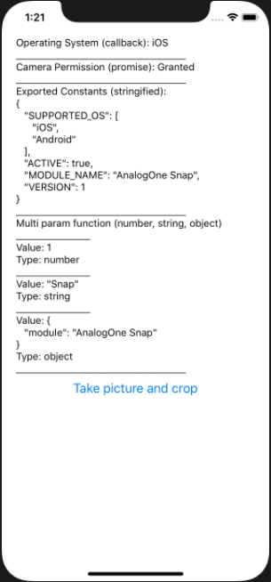

# react-native-analogone-snap



Analog one test that takes a picture from device camera and some other implementations:
1. module must be triggering events (atleast 1) from native-module to react-native code. (JS)
2. module must expose types from native-module to react-native code (JS)
3. module must expose constants from native-module to react-native code (JS)
4. module must expose a method that takes three different types of input parameters and returns a response that include all the three params.
5. module must expose a method that handles capturing of image from camera of device and then crop it.
6. methods supporting Promise Based approach as well as Callback based approach.

This project has React native module build for iOS (Swift) and Android (Kotlin) with an exmaple React native project (Typescript)

## How was it built?
Native module was built using React-native-builder-bob
https://github.com/callstack/react-native-builder-bob

React-native-builder-bob is a command line interface for building React Native libraries for different targets.

## Why chose ## react-native-builder-bob?
With this builder CLI we can easily build React native modules/libraries with:
- Simple example modules for Android and iOS which you can build upon
- Kotlin configured for building the module on Android


# Installation

```sh
npm install react-native-analogone-snap
```
## iOS
```sh
yarn example ios
```
## Android
```sh
yarn example android
```

# Data access flow
## iOS
React (APP) <- NativeModules <- React Native (Module) <- RCT_EXTERN_MODULE <- Objective-C (Class) <- @objc <- Swift (Class)
 
## Android 
React (APP) <- NativeModules <- React Native (Module) <- ReactPackage <- ReactContextBaseJavaModule

